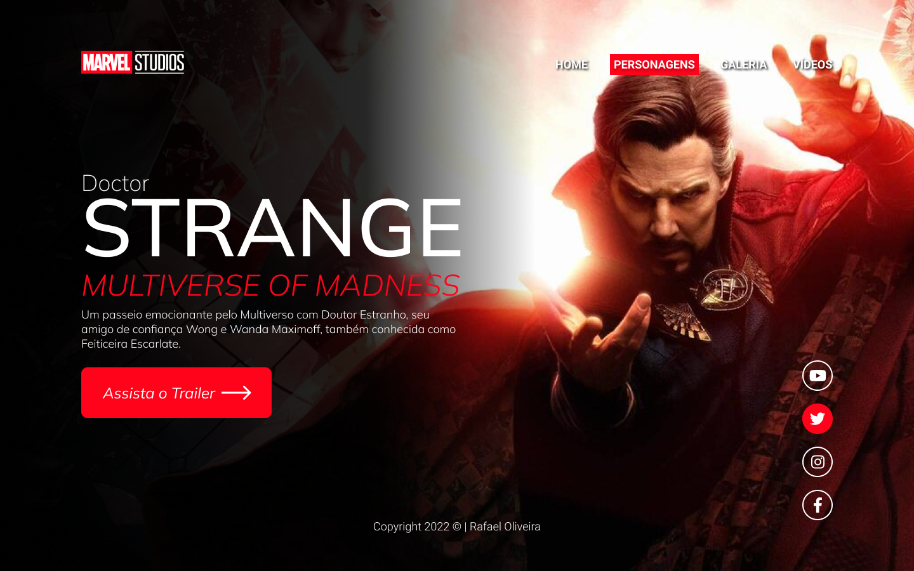
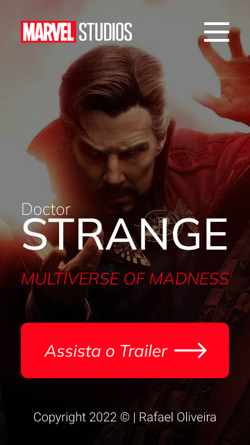
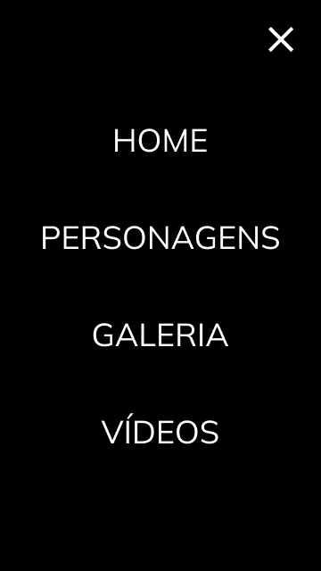

# "STRANGE"

### Projeto construído durante as aulas de LIMA (Linguagem de Marcação), no curso de Desenvolvimento de Sistemas do [Senai Jandira](https://jandira.sp.senai.br/), com orientação do Professor [Fernando Leonid](https://github.com/fernandoleonid) 

---

  

---

## Objetivo do Projeto

O projeto tinha como objeto criar uma Landing Page baseados no filme "Doutor Estranho no Multiverso da Loucura", desde seu design inicial na plataforma "Figma", até a programação e configuração de todas as páginas usadas em HTML, CSS e JAVASCRIPT.

## O que é uma "Landing Page"?

Landing Pages são páginas com foco principal na conversão de visitantes, assim, essas páginas possuem uma estética mais minimalista comparada com os sites tradicionais.

---

## Técnologias Usadas

* HTML5
* CSS 3
* JAVASCRIPT
* Figma

---

Todo o projeto foi feito e construído usando o Visual Studio Code como principal ferramenta de codificação.

---
## Links

* [Resultado Final](https://rafaeloliveira3.github.io/strange/)
* [Projeto no Figma](https://www.figma.com/file/KogWSB7IiluHTJ13K6L1Kv/TESTE-FIGMA?node-id=6%3A34)
* [Código](https://github.com/rafaeloliveira3/strange)

---

## Autor

[Rafael Oliveira](https://github.com/rafaeloliveira3)